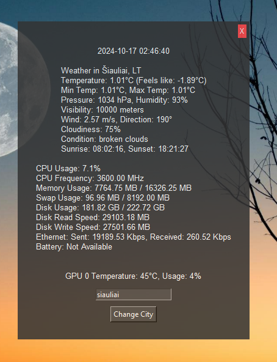

# AllInOneWidget

## Description
The **AllInOneWidget** is a Python-based desktop widget built with Tkinter that displays real-time system stats, weather information, date and time, and GPU usage/temperature. It includes features such as a draggable window, real-time updates, and the ability to change the city for weather updates.

## Features
- **Weather Info:** Get real-time weather updates using the OpenWeather API.
- **System Stats:** Displays CPU usage, memory usage, disk space, and network activity.
- **GPU Monitoring:** Fetches GPU temperature and usage (requires `nvidia-smi`).
- **Real-Time Clock:** Shows the current date and time.
- **Custom City Input:** Allows you to change the city to get weather updates for a different location.
- **Draggable Window:** The widget can be repositioned on the desktop by dragging.
- **Transparency:** The widget has a slight transparency effect for aesthetic purposes.

## Prerequisites
- **Python 3.x**
- The following Python libraries:
  - `Tkinter`
  - `requests`
  - `psutil`
- For GPU monitoring, you need `nvidia-smi` installed and accessible on your system.

To install the required libraries, run:
```bash
pip install requests psutil
```

## How It Works

### Step 1: Setting Up the GUI
The app uses Tkinter to create the graphical user interface. The main window is created with the following features:

- `overrideredirect(True)`: This removes the default window borders to create a frameless widget.
- `wm_attributes("-topmost", True)`: Keeps the widget always on top of other windows.
- **Draggable window**: The widget can be repositioned on the screen by clicking and dragging with the mouse.

### Step 2: Initializing Variables

- **Weather Data**: The default city is set to Wolverhampton, and the OpenWeather API key is provided.

- **Network Traffic Tracking**: Two variables, prev_sent and prev_recv, are initialized to track network data usage.

### Step 3: GUI Components
Several labels and buttons are created:
- **Time Label**: Displays the current time and updates every second.
- **Weather Label**: Displays the weather data fetched from the OpenWeather API.
- **System Stats Label**: Shows CPU, memory, disk usage, and network statistics.
- **GPU Label**: Displays GPU temperature and usage (if nvidia-smi is available).
- **City Input & Button**: Allows the user to change the city for weather updates by typing in a new city name and clicking "Change City."

### Step 4: Styling the GUI

A custom font is applied to all the labels, and the background color is set to `#333333` for a sleek dark theme. The close button is styled and positioned at the top right.

### Step 5: Time Updates

The time is updated every second using the `after()` method:
```bash
self.window.after(1000, self.update_time)
```
This method schedules the `update_time` function to be called every 1000 

### Step 6: Weather Updates
The weather data is fetched using the OpenWeather API. This is done in the background using threading:

```bash
threading.Thread(target=self.update_weather).start()
```
The `update_weather()` method:

- Makes an API request using the `requests` library.
- Parses the weather data and updates the weather label with relevant information (temperature, humidity, wind speed, etc.).
- The weather data is updated every 10 minutes (600,000 milliseconds).

### Step 7: System Stats Updates
System information such as CPU usage, memory, swap, and disk space is fetched using the `psutil` library. Similar to weather updates, system stats are fetched in a separate thread:
```bash
threading.Thread(target=self.update_system_stats).start()
```
- CPU and memory usage are refreshed every second.
- Network traffic speeds (upload and download) are calculated by comparing the current network I/O counters with previously stored values.
- Disk read and write speeds are shown.

### Step 8: GPU Temperature & Usage
The GPU stats are fetched using `nvidia-smi`. A subprocess is created to run the command:
```bash
subprocess.Popen(['nvidia-smi', '--query-gpu=temperature.gpu', '--format=csv,noheader,nounits'], ...)
```
This method:

- Retrieves the GPU temperature and usage.
- Updates the GPU label every 5 seconds.

### Step 9: Changing the City
Users can type a city name in the input field and click the "Change City" button to update the city for weather data. The city name is stored, and the next API request uses this updated city:
```bash
self.CITY = self.city_entry.get()
```

### Step 10: Draggable Window

The window can be dragged by holding the left mouse button. Two event bindings handle this:

- start_drag: Captures the initial position when the mouse button is pressed.
- drag_motion: Updates the window's position as the mouse is moved.

### Step 11: Continuous Updates

Each piece of information (time, weather, system stats, GPU info) is updated at regular intervals using the `after()` method, ensuring the data displayed remains up-to-date.

## Running the Application
Simply run the script using Python:
```bash
python manager.py
```
The widget will appear on your screen, showing system stats, weather, time, and GPU information. You can drag it to any position and close it using the "X" button in the top-right corner.

## Customization
- `Change the City`: You can change the default city by typing in the city name in the entry box and clicking "Change City."
- `Adjusting Update Intervals`: The `after()` methods control how often different parts of the widget update (time, weather, system stats, etc.). These can be adjusted based on your needs.
- `Window Transparency`: The transparency of the window is set to 85% `(self.window.attributes('-alpha', 0.85))`. You can modify this value if needed.

## GPU Monitoring (Optional)
To monitor GPU temperature and usage, you need to have NVIDIA's nvidia-smi tool installed. This tool is typically installed with NVIDIA drivers.

